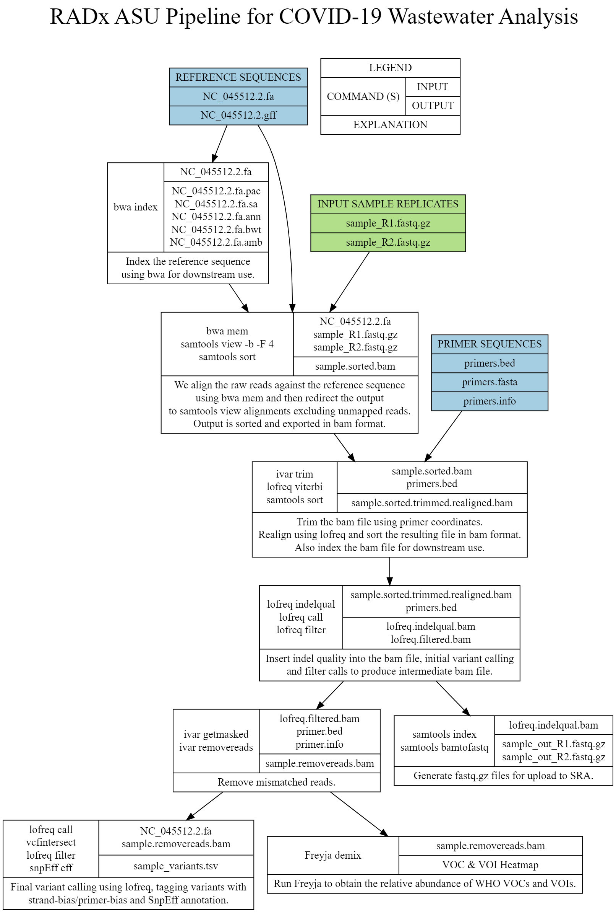

# RADx-rad
RADx-rad pipeline for metagenomic data and analysis of SARS-CoV-2 from wastewater samples.

## Please note: This project is currently under development.

Currently, the architecture and information flow in this pipeline is designed as shown below.


# Requirements
Please install the following 
* [Python 3.7+](https://www.python.org) - Our code runs on Python
* [BWA 0.7.17](https://github.com/lh3/bwa)
* [htslib 1.12](http://www.htslib.org/download/)
* [samtools 1.12](http://www.htslib.org/download/)
* [iVar 1.3](https://github.com/andersen-lab/ivar) - Mac users, please install iVar from source and not from conda.
* [bedtools 2.30.0](https://bedtools.readthedocs.io/en/latest/content/installation.html)
* [alcov 0.1.1](https://github.com/amagge/alcov/) - fork of the original project available at (https://github.com/Ellmen/alcov/)

If you installed BWA or other tools at a custom location, you may have to add the executable to the environment PATH table. You may also have to run them when you restart your computer.  
```
export PATH="$PATH:PATH-TO-CUSTOM-LOCATION-CONTAINING-BINARIES"
```
e.g.
```
export PATH="$PATH:/Users/amagge/pyspace/radx/resources/bwa"
export PATH="$PATH:/Users/amagge/pyspace/radx/resources/htslib/bin"
export PATH="$PATH:/Users/amagge/pyspace/radx/resources/samtools/bin"
```

# Installation instructions
Copy ```radx/settings_template.py``` into a new file and rename the new file to ```radx/settings.py``` and change paths if necessary.

For now, the project can be run in standalone mode using the following command:
```
python radx.py
```

There are some options when it comes to running radx, you may view these by running:
```
python radx.py --help
```
